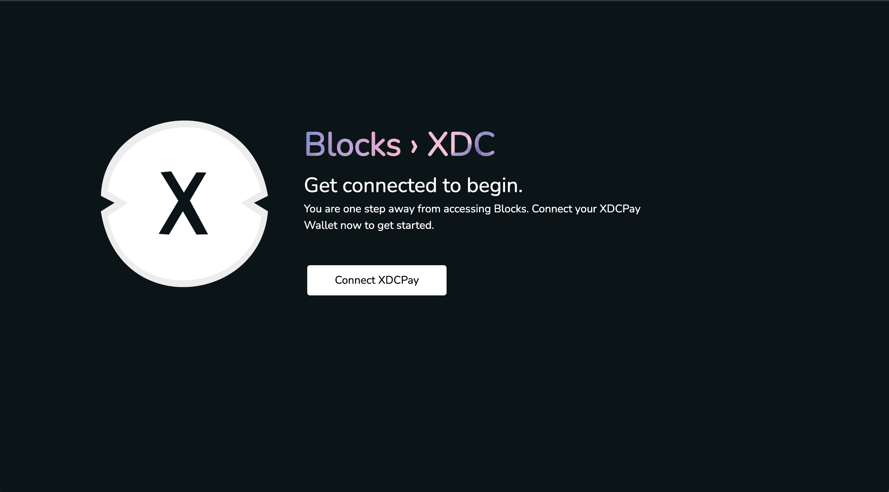
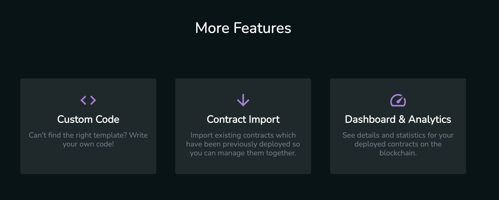
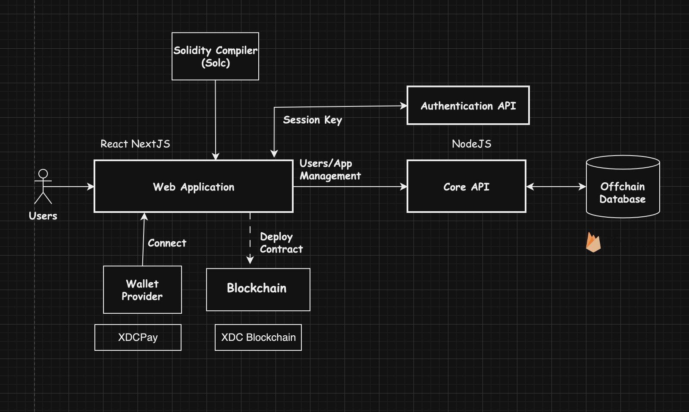
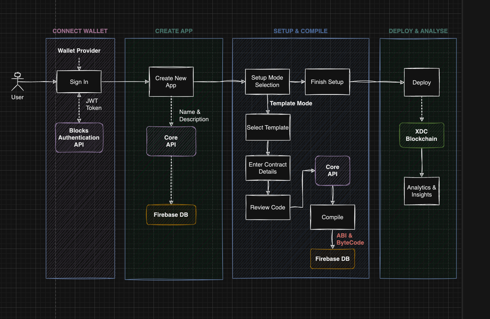
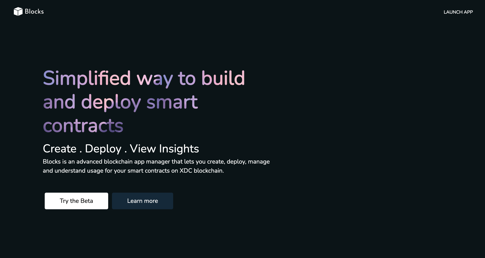
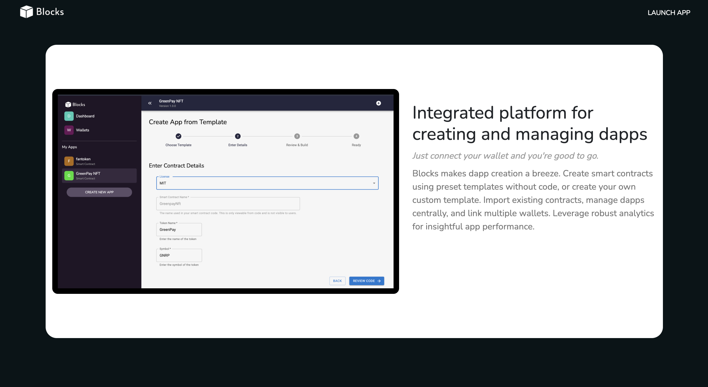
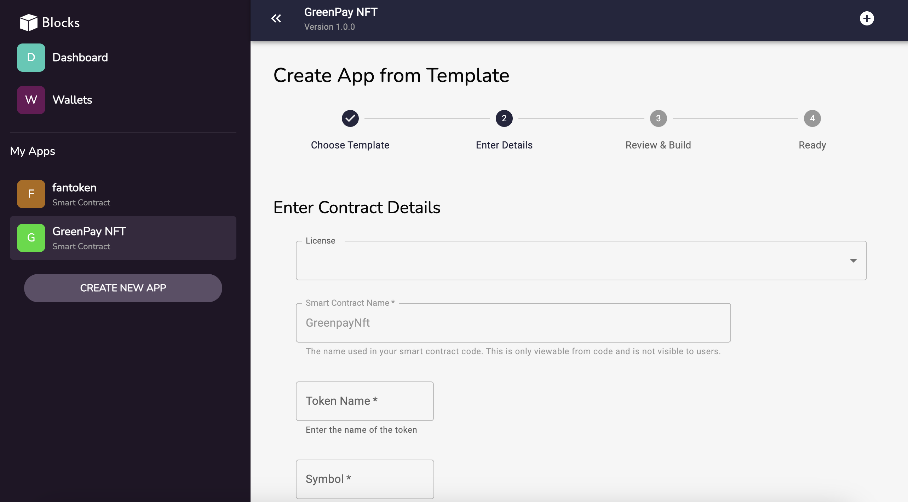
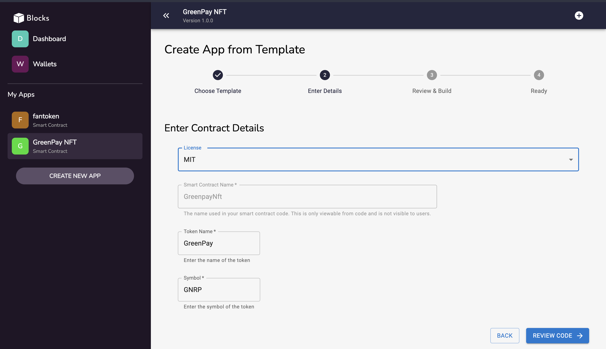

# Blocks

## Revolutionizing Smart Contract Creation, Deployment and Management on Open Campus Codex Blockchain

**Blocks** is an innovative platform designed to simplify the creation, deployment, and management of smart contracts on the **Open Campus Codex Blockchain**. Our goal is to empower users—regardless of technical background—to seamlessly navigate the world of blockchain technology.

**Project Website**: [Explore Blocks](https://blocks-edu.vercel.app/)

**Note**: This alpha release is intended for testing and development. Expect significant enhancements and additional features in the final version.

---

## Introducing Blocks: Your Smart Contracts Hub

    

### Inspiration

We posed a crucial question: *"How can we democratize blockchain technology and smart contracts, making them accessible to everyone, regardless of their technical skills?"*

The answer was **Blocks**—a platform born from the recognition that while blockchain technology promises transformative potential, its complexity often hinders its widespread adoption. We envisioned a tool that bridges the gap between sophisticated blockchain capabilities and users with no technical background, providing them with an intuitive and accessible interface to bring their decentralized applications (dApps) to life.

### About Blocks

**Blocks** is a user-friendly smart contract manager tailored for the **Open Campus Codex Blockchain**. It offers an intuitive platform for creating, deploying, managing, and analyzing smart contracts, making blockchain technology accessible to both novices and seasoned developers.

With features like no-code templates, multi-wallet integrations, and comprehensive analytics, **Blocks** is set to democratize blockchain development and pave the way for a more decentralized digital future.

---

## Key Features

    

    

**No-Code Contract Builder**
- Effortlessly build and customize smart contracts using our extensive collection of pre-designed templates—no coding required.

**App Manager**
- Create and manage multiple dApps, each with its own set of smart contracts, providing a comprehensive view of your blockchain projects.

**Integrated Solidity Compiler**
- Compile your smart contracts directly within the platform, streamlining the development process.

**One-Click Deployment**
- Deploy your contracts on the Open Campus Codex mainnet and testnet with a single click.

**Upcoming Enhancements**
- Advanced code editor for custom contract development.
- Import and manage existing contracts.
- Multi-wallet support.
- App version management.
- Advanced contract analytics and insights.

---

---

## Available Smart Contract Templates

**Blocks** offers a range of smart contract templates to suit various needs. Here are some of the templates available on our platform:

**1. One-Time Subscription Contract**
- **Description**: Manage product subscriptions with one-time payments. Owners can add products, set prices, and users can subscribe by paying the set price.
- **Key Features**: Product management, subscription tracking, and fund withdrawal.

**2. Supply Chain Management Contract**
- **Description**: Track and verify products at each stage of a supply chain. Ideal for businesses looking to enhance transparency and traceability.
- **Key Features**: Product tracking, verification, and data recording.

**3. Token Sale Contract**
- **Description**: Facilitate fundraising by selling a token at a specified rate. Perfect for launching new tokens and raising capital.
- **Key Features**: Token purchasing, rate management, and fund withdrawal.

**4. Royalty Distribution Contract**
- **Description**: Manage and distribute royalties to multiple recipients. Allows setting and distributing royalties based on predefined criteria.
- **Key Features**: Royalty setting, distribution management, and recipient tracking.

**5. Crowdfunding Contract**
- **Description**: Raise funds for projects through a crowdfunding model. Allows contributions from multiple users and tracks funding progress.
- **Key Features**: Campaign creation, fund collection, and contribution tracking.

**6. Voting Contract**
- **Description**: Implement decentralized voting systems for proposals or elections. Supports anonymous and tamper-proof voting.
- **Key Features**: Proposal management, voting process, and result tallying.

**7. Identity Verification Contract**
- **Description**: Manage and verify user identities on the blockchain. Useful for applications requiring verified user credentials.
- **Key Features**: Identity registration, verification, and access control.

**8. Licensing Contract**
- **Description**: Issue and manage licenses for digital assets or services. Tracks license issuance and usage.
- **Key Features**: License creation, tracking, and enforcement.

**9. Escrow Contract**
- **Description**: Facilitate secure transactions by holding funds in escrow until predefined conditions are met.
- **Key Features**: Escrow management, condition checks, and fund release.

**10. Rental Agreement Contract**
- **Description**: Manage rental agreements for assets or properties. Supports rental payments and agreement enforcement.
- **Key Features**: Rental terms management, payment tracking, and contract enforcement.

**10. And Many More Coming Soon..**

---

## Business Model

    

While **Blocks** will continue to offer a wealth of features for free, we plan to introduce a freemium model to support ongoing development. Basic functionalities will remain free, with premium options available for advanced features.

**Community-Contributed Templates**: We're exploring ways to allow developers to contribute their own templates, potentially earning from their usage.

---

## Technical Details

### Architecture Overview

    

#### Web Application & APIs
- The front-end is crafted in **React** with **NextJS**, while core functionalities are powered by NodeJS. Our applications are hosted on [Vercel](https://www.vercel.com).

#### Compiler
- We utilize [Solidity Compiler (Solc)](https://www.npmjs.com/package/solc) to transform Solidity code into Contract Application Binary Interface (ABI) and bytecode.

#### Contract Interactions/Deployments
- [Web3.js](https://github.com/web3/web3.js) handles all contract interactions and deployments.

#### Offchain Database
- Encrypted messages and application operations are stored in our offchain database hosted on [Google Firebase](https://firebase.google.com) using Firestore.

### Process Flow

    

#### Wallet Connection & Authentication
- Users connect to the Open Campus Codex Blockchain via wallet providers like MetaMask, sign a message for authentication, and receive a JWT token for API access.

#### App Creation
- Users create their first app—an organized container for managing smart contracts. Multiple apps can be created and managed.

#### Contract Setup & Compilation
- Setting up a contract is streamlined: select a template, customize details, review and compile the code.

#### Deployment
- Deploy compiled contracts with a single click. Monitor transaction data and gain insights from the blockchain.

---

## Project Roadmap

**Q4 2024**
- Project initiation, planning, and prototyping
- MVP development and beta launch on mainnet

**Q1 & Q2 2025**
- Feature expansion and refinement
    - Version management, wallet management, analytics, and insights
    - Contract import and custom code
    - Additional templates
- Public outreach and marketing
- Full launch of the stable version on mainnet

---

## Screenshots

    

    

    

    

    

    

---

With **Blocks**, we are not just building a tool but fostering a new era of accessibility and innovation in blockchain technology. We invite you to join us in this transformative journey.

---

